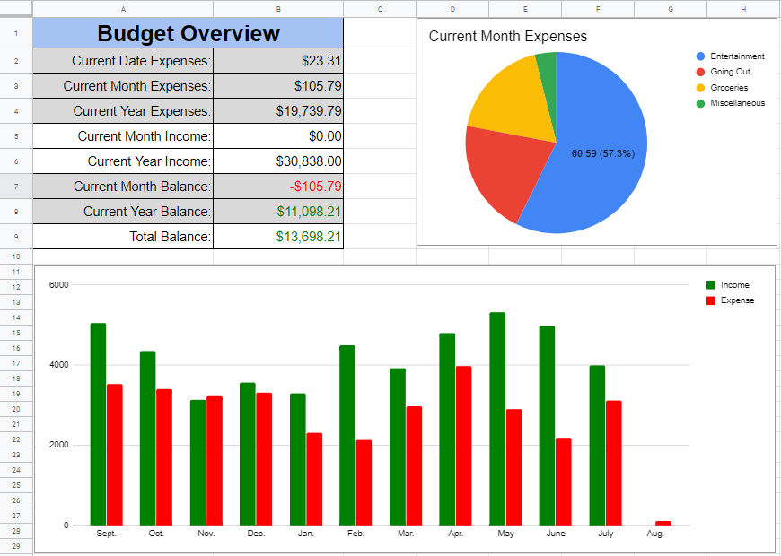

# Personal Budgeting Tool

My personal budgeting tool to keep track of my finances, taking advantage of Google Sheets and Google Forms for an elegant user interface.
Data is inputted through Google Form, and output is rendered in Google Sheets. 
The *Code.gs* file is the only necessary program, and consists of Google Apps Script code used in Google Sheets.
Through these functions, the spreadsheet can create visualizable data without any manual interactions with spreadsheet cells. 
\
\
\
  

## Set Up Instructions
### 1. Create Google Form ###
This set of instructions assume that you have a Google account with access to Google Drive. From the [Google Drive](https://www.google.com/drive/) page, create a new Google Form through `New -> More -> Google Forms`. The Google Form will have three questions.  
  
Set the first question to be the *Category*, which is a dropdown type. You can add as many options as you need, but one option must be for your incomes, labeled *Income*. The rest of the options you add must be your categories for expenses. Make sure this question is toggled as *Required*.  
  

Set the second question to be the *Description*, which is a short answer type. This will just be a description of the input for your personal records, and could be required or not.  
  

Set the third question for the *Amount*, which is a short answer type. This will be the positive numerical amount of the income or expense, and should be a *Required* question. Also set a response validation for this question to ensure that the input is a number greater than zero.  
  

### 2. Connect to Google Sheets ###
On the top of the Google Form you just completed, go to `Responses -> Create Spreadsheet -> Create a new spreadsheet`. This spreadsheet that you are about to create will store your form responses as well as display your budget dashboard, so name it accordingly. The newly created Google Sheets should pop up.  
  
  
At the bottom of the Google Sheets, you should see the sheet named *Form Responses 1*. Rename the sheet to *Form Responses*. Add two more sheets, named *Dashboard* and *Data*, which will be for the dashboard with visualizable data and the sheet to store computed data, respectfully.  
  

### 3. Add the Script to Google Sheets ###
Now, on the Google Sheets, navigate to `Tools -> Script editor`, which should open a Scripts Editor with the *Code.gs* file currently open. You can name the Script whatever you want. Next, delete its contents and replace it with the contents of the *Code.gs* file located in this Github repository. After copying over the contents, save the file with *Ctrl+S*. 
  
Finally, on top of the Scripts page, navigate to `Run -> Run function -> init`. This will initialize all necessary triggers and visualizations so your data input through Google Forms automatically gets updated on the dashboard. You might have to authorize the script to read and write to your spreadsheet. To authorize the script through the popup, check the `Advanced` options.  

### 4. Start Adding to the Google Form ###
You are now ready to input data through the Google Form! In the Google Form you created, go to `Responses -> Send -> Send via Link`. Save the link displayed, as you can access the form to fill out through the url. And now you're set!
